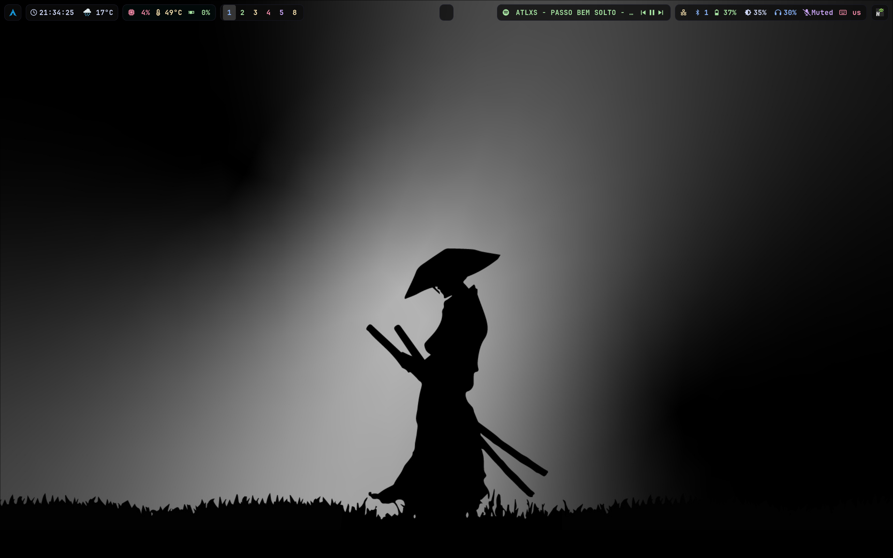
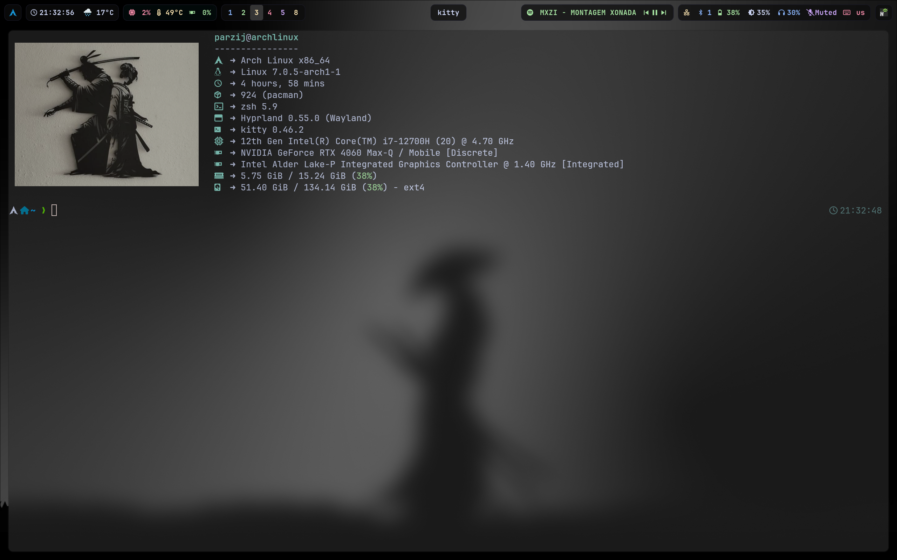

# Arch Linux • Hyprland Rice

> Минималистичный, но мощный и эстетичный setup Hyprland на Arch Linux





## ✨ Особенности

- **Чистый и современный дизайн** с акцентом на тёмную тему и Catppuccin-inspired цвета
- **Оптимизированный Waybar** с группировкой модулей, кастомными таблетками и интеграцией Spotify
- **Полная поддержка ASUS ROG** (asusctl, power profiles, клавиши, подсветка клавиатуры)
- **Гибридная графика** Intel + NVIDIA (правильная настройка `WLR_DRM_DEVICES`)
- **Красивый календарь** в часах с анимациями
- **Удобное управление** медиа, сетью, Bluetooth и питанием
- **Плавные анимации** и blur-эффекты

## 🛠️ Стек

- **OS**: Arch Linux
- **WM**: Hyprland
- **Bar**: Waybar
- **Launcher**: Wofi
- **Terminal**: Kitty
- **Notification**: Swaync
- **Wallpaper**: `swaybg`
- **Theme**: Catppuccin Mocha + custom accents

## 📸 Скриншоты


## 🚀 Установка

```bash
# Клонируем репозиторий
git clone https://github.com/parzij/ArchLinux-setup.git ~/.config/hypr
cd ~/.config/hypr

# Или используй symlinks (рекомендуется)
stow */ --target=$HOME/.config
```

### Важные зависимости

```bash
# Основные пакеты
sudo pacman -S hyprland waybar kitty wofi swaync swaybg playerctl pamixer brightnessctl \
               asusctl nvidia nvidia-utils polkit-gnome grim slurp

# Для Spotify-контроля
yay -S playerctl
```

После установки запусти:
```bash
hyprctl reload
```

## 📁 Структура конфигов

```bash
.
├── hypr/
│   └── hyprland.conf          # Основная конфигурация Hyprland
├── waybar/
│   ├── config.jsonc
│   └── style.css
├── waybar/scripts/
│   └── waybar-wttr.py         # Погода
└── ...
```

## 🎨 Цветовая схема

Используется тёмная палитра с акцентами:
- `Rosewater`, `Flamingo`, `Pink`, `Mauve`, `Sky`, `Teal`, `Green`, `Yellow`

## 🔧 Особенности настройки

- Гибридная графика Intel (для Wayland) + NVIDIA (для тяжёлых приложений)
- Кастомные бинды под ASUS ROG
- Группа Spotify в Waybar с кнопками управления
- Красивые закруглённые "таблетки" в баре
- Автоматическое переключение power profile через `asusctl`

## 📄 Лицензия

Проект распространяется под лицензией **MIT** — см. файл [LICENSE](LICENSE).

---

**Сделано с ❤️ для сообщества Hyprland**

Если тебе понравился мой rice — ставь ⭐!
